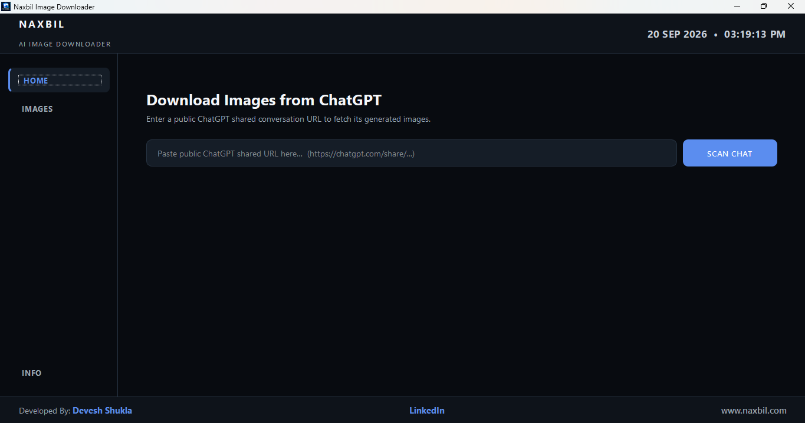
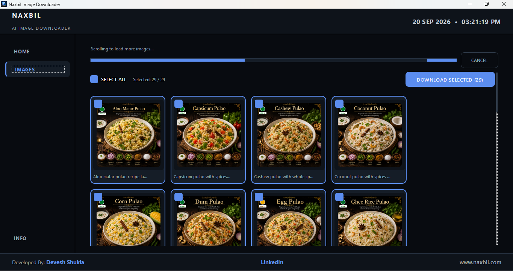
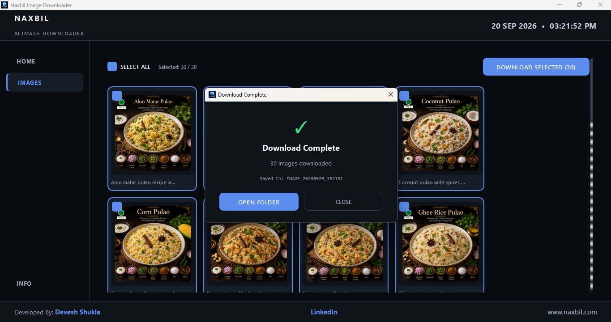
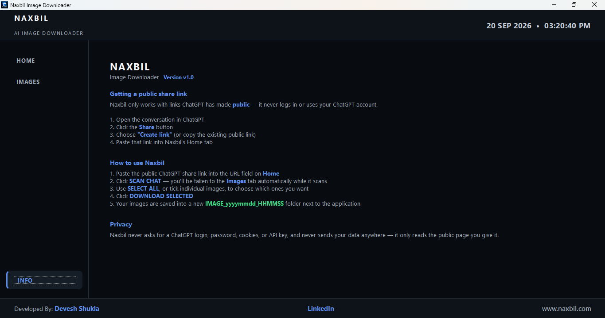

# Naxbil Image Downloader

**Download AI-generated images from public ChatGPT shared conversation links**

No login. No API key. Just paste and download.

---

## Screenshots

### Home — Paste your ChatGPT share link

### Scan Results — Preview & select images

### Download Complete

### Info — Built-in usage guide

---

## Features

- 🔗 Paste any public ChatGPT shared link (`chatgpt.com/share/...`)
- 🖼️ Automatically scans and loads all AI-generated images from the conversation
- ✅ Select All or pick individual images
- 📁 Batch download to a timestamped folder (`IMAGE_yyyymmdd_HHMMSS`)
- 🔒 Privacy-first — never asks for login, password, cookies, or API key
- 💻 Dark-themed, clean desktop UI

## How to Use

1. Open a ChatGPT conversation that contains generated images
2. Click **Share** → **Create link** (or copy the existing public link)
3. Open **Naxbil Image Downloader**
4. Paste the link on the **Home** tab → click **SCAN CHAT**
5. Switch to the **Images** tab — all found images appear as a grid
6. Use **SELECT ALL** or tick individual images
7. Click **DOWNLOAD SELECTED** — images are saved to a folder next to the app

## System Requirements

- Windows 10 / 11
- No additional software needed (Chrome driver is bundled)

## Tech Stack

- **Python** — Core logic
- **PySide6** — Desktop GUI
- **Selenium** — Browser automation for scraping public share pages

## Privacy

Naxbil Image Downloader only reads the **public** page you give it. It never logs in to your ChatGPT account, never stores cookies, and never sends your data anywhere.

## About

Built by **[Naxbil](https://naxbil.com)** — a software studio based in Pune, India.

- 🌐 [naxbil.com](https://naxbil.com)
- 💼 [LinkedIn](https://linkedin.com/in/devesh-shukla-er)

## License

[MIT License](LICENSE)

---

⭐ **If this tool saved you time, star the repo!**

